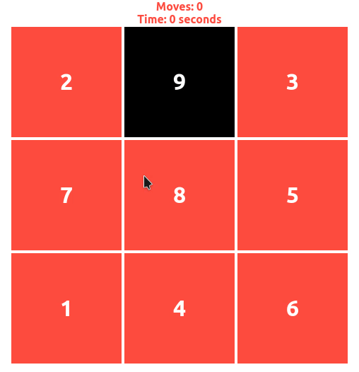
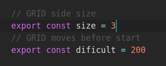
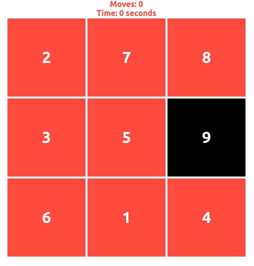
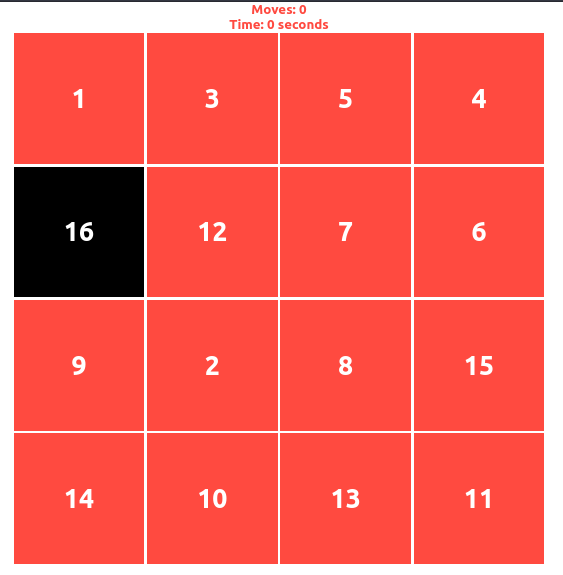

### `N-puzzle`
#### 3,4 or N size puzzle game :video_game:

### Change size :
 just edit `src/Utils.js`
 you can also edit  the number of previus random steps after start the game

## Usage:
### just run:
###### npm install
###### npm start
### if you want to build:
###### npm build

This project was bootstrapped with [Create React App]
